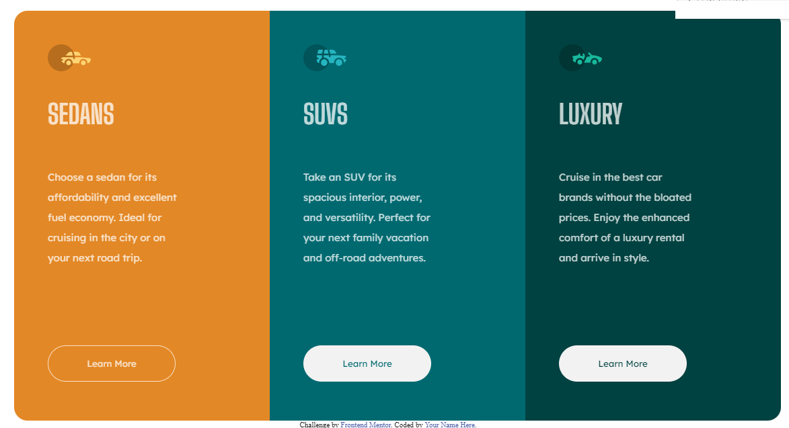
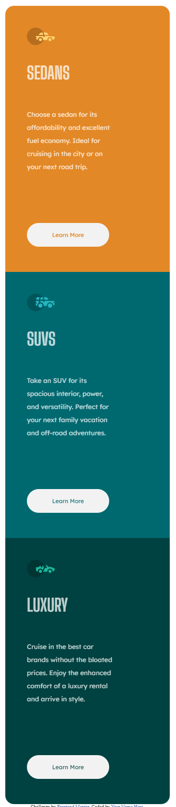

# Frontend Mentor - 3-column preview card component solution

This is a solution to the [3-column preview card component challenge on Frontend Mentor](https://www.frontendmentor.io/challenges/3column-preview-card-component-pH92eAR2-). Los desafíos de Frontend Mentor lo ayudan a mejorar sus habilidades de codificación mediante la creación de proyectos realistas.

## Table of contents
- [Resumen](#overview)
   - [El reto](#the-challenge)
   - [Captura de pantalla](#screensho)
   - [Enlaces](#links)
- [Mi proceso](#my-process)
   - [Construido con](#built-with)
   - [Lo que aprendí](#what-i-learned)
   - [Desarrollo continuo](#continued-development)
   - [Recursos útiles](#useful-resources)
- [Autor](#author)
- [Agradecimientos](#acknowledgments)

## Overview
Usando por primera vez Figma para crear el boceto y luego hacerlo en el IDE

### The challenge
Los usuarios deben ser capaces de:

- Ver el diseño óptimo según el tamaño de pantalla de su dispositivo
- Ver estados de desplazamiento para elementos interactivos

### Screenshot
Escritorio

El botón seleccionado

Versión móvil

### Links

- Solution URL: [Add solution URL here](https://your-solution-url.com)
- Live Site URL: [Add live site URL here](https://your-live-site-url.com)
- Figma [Boceto con figma](https://oswaldo.dev/portafolio/3-colum-card/design/coches.fig);

## My process
Crar el boceto con figma y hacerlo en VSCode 

### Built with

- Figma
- HTML5
- CSS custom properties
- Flexbox
- ~~CSS Grid~~
- Mobile-first workflow
- ~~[React](https://reactjs.org/) - JS library~~
- ~~[Next.js](https://nextjs.org/) - React framework~~
- ~~[Styled Components](https://styled-components.com/) - For styles~~

### What I learned
La verdad es que hacer primero el diseño en Figma adelantas mucho la faena de el llevarlo a escribir el código. Es un tiempo que gastas en un principio pero el trabajo se adelanta mucho al tener ya muy claras las medidas, colores y la posición de los objetos.

### Continued development

Figma, etiquetas semánticas y el CSS

### Useful resources
Figma

## Author
- Sitio web - [oswaldo.dev](https://oswaldo.dev/portafolio)
- Mentor de frontend - [@OswaldoDomingo](https://www.frontendmentor.io/profile/OswaldoDomingo)

## Acknowledgments

A toda la gente que comparte su conocimento.