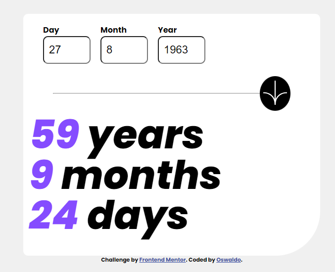
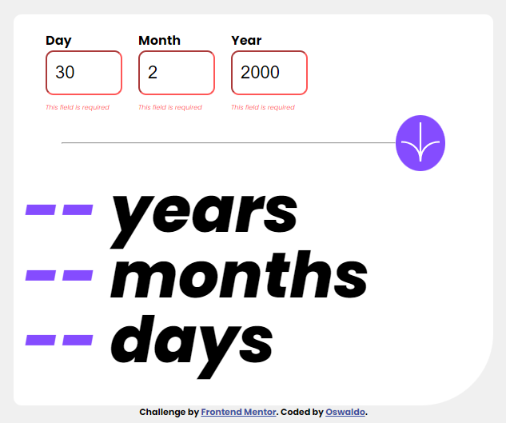

# Frontend Mentor - Age calculator app solution

Esta es una solución al [desafío de la aplicación de calculadora de edad en Frontend Mentor](https://www.frontendmentor.io/challenges/age-calculator-app-dF9DFFpj-Q). Los desafíos de Frontend Mentor lo ayudan a mejorar sus habilidades de codificación mediante la creación de proyectos realistas.

## Table of contents

- [Descripción general](#overview)
  - [El reto](#the-challenge)
  - [Captura de pantalla](#screenshot)
  - [Enlaces](#links)
- [Mi proceso](#my-process)
  - [Construido con](#built-with)
  - [Qué he aprendido](#what-i-learned)
  - [Desarrollo contínuo](#continued-development)
  - [Recursos útiles](#useful-resources)
- [Autor](#author)
- [Agradecimientos](#acknowledgments)

## Overview

### The challenge

Los usuarios deben ser capaces de:

- [x] Ver una edad en años, meses y días después de enviar una fecha válida a través del formulario
- [x] Recibir errores de validación si:
   - [x] Cualquier campo está vacío cuando se envía el formulario
   - [x] El número de día no está entre 1-31
   - [x] El número del mes no está entre 1-12
   - [x] El año está en el futuro.
   - [x] La fecha no es válida, p. 31/04/1991 (hay 30 días en abril)
- [x] Ver el diseño óptimo para la interfaz según el tamaño de pantalla de su dispositivo
- [x] Vea los estados de desplazamiento y enfoque para todos los elementos interactivos en la página
- [x] **Bonificación**: vea los números de edad animados a su número final cuando se envía el formulario

### Screenshot






### Links

- Solución URL: [Solución URL](https://your-solution-url.com)
- Live Site URL: [Live site](https://oswaldodomingo.com/portafolio/age-calculator/)

## My process

### Built with
- Marcado HTML5 semántico
- Propiedades personalizadas de CSS
- Caja flexible
- Cuadrícula CSS
- Flujo de trabajo móvil primero
- [React](https://reactjs.org/) - ~~JS library~~
- [Next.js](https://nextjs.org/) - ~~React framework~~
- [Styled Components](https://styled-components.com/) - ~~For styles~~

### What I learned

Use esta sección para recapitular algunos de sus principales aprendizajes mientras trabajaba en este proyecto. Escribirlos y proporcionar ejemplos de código de las áreas que desea resaltar es una excelente manera de reforzar su propio conocimiento.

Para ver cómo puede agregar fragmentos de código, consulte a continuación:

```html
<h1>Algún código HTML del que estoy orgulloso</h1>
```
```css
/*
Para que funcione lo del borde cuando está en focus 
    outline: none; es fundamental
*/
input[type=text]:focus{
    outline: none;
    border:2px solid hsl(259, 100%, 65%);
}
/*
Animación cuando salen los resultados
*/
.resultado-nuevo{
    animation-duration: 3s;
    animation-name: slidein;
    color: hsl(259, 100%, 60%);
    
      
}
@keyframes slidein {
    from {
      margin-left: 20%;
      width: 10%
    }
  
    to {
      margin-left: 0%;
      width: 100%;
    }
  }
```
```js
/* Importante, he de meter en la función lal recogida de los datos, me volví loco pensando prtque no funcionaba... ¿ámbito de variables? en J no pasaba esto he de investigar...
*/
function pulsia() {
    //id = year, id = mounth, id = day 
    let dia = document.getElementById('day');
    let mes = document.getElementById('mounth');
    let anyo = document.getElementById('year');

    //Recoger los datos de los input
    let unDia = parseInt(dia.value);
    let unMes = parseInt(mes.value);
    let unAnyo = parseInt(anyo.value);
}
```

### Continued development

Mejorar los efectos de CSS y de javascript


### Useful resources

- [Date()](https://www.freecodecamp.org/espanol/news/javascript-date-now-como-obtener-la-fecha-actual-con-javascript/#:~:text=getMonth()%20%2B%201%3B,y%20el%2011%20es%20diciembre.) - Javascript la función Date()
- [CSS @keyframes](https://developer.mozilla.org/en-US/docs/Web/CSS/@keyframes) - para crear los efectos de CSS.


## Author

- Website - [Oswaldo](https://www.your-site.com)
- Frontend Mentor - [@OswaldoDomingo](https://www.frontendmentor.io/profile/OswaldoDomingo)
- Twitter - [@oswaldomingo](https://www.twitter.com/oswaldomingo)

## Acknowledgments
A todo el mundo que aporta su conocimento en la red.